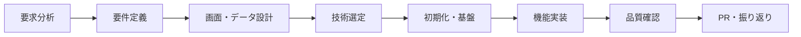
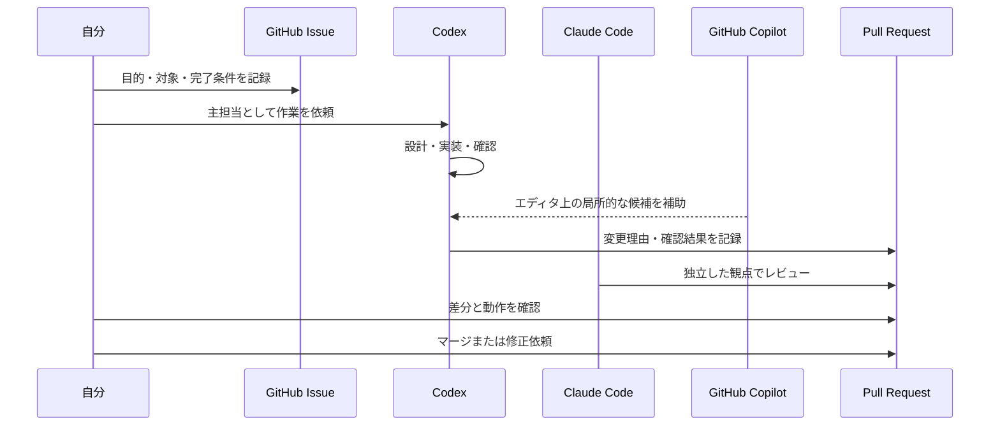

# 個人用 AI協働ガイド

このファイルは、タスク管理アプリの学習・開発で Codex、Claude Code、GitHub Copilot を使い分けるための個人用ガイドである。要件定義・設計資料ではなく、作業を始める前やGitHub Issue／PRを作成する際に参照する。

AIが出した内容は必ず自分で確認し、要件、採用案、外部公開、マージの最終判断は自分が行う。

## 基本ルール

- 同じファイルを複数のAIに同時編集させない。
- 作業はGitHub Issue単位に分け、主担当とレビュー担当を決める。
- 主担当は利用者または1つのAIだけにする。ほかのAIは提案・レビューを担当する。
- `main` は統合済みの安定版とする。作業はブランチで行い、PRで確認してからマージする。
- AIの回答をそのまま正とせず、Issue、設計資料、差分、実行結果を根拠に判断する。

## 全体の流れ



## 工程別の役割分担

| 工程 | 主担当 | Codex | Claude Code | GitHub Copilot | 自分が決めること | GitHub上の記録 |
|---|---|---|---|---|---|---|
| 要求分析 | 自分 + Codex | 質問の整理、課題・目的・MVP境界の文書化 | 漏れ・過大な範囲を別視点で確認 | 使用しない | 目的、優先順位、対象外 | Issueまたは要件資料 |
| 要件定義 | Codex | 機能・非機能・データ・完了条件を構造化 | 矛盾、例外、曖昧表現をレビュー | 使用しない | 採用・保留・削除 | `docs/*` とIssue |
| 画面・データ設計 | Codex | Mermaid図、画面状態、データモデルを作成 | 操作性、整合性、例外処理をレビュー | UI部品・型の候補を補助 | 操作感、優先順位、データ項目 | 設計資料・Issue |
| 技術選定 | 自分 + Codex | 比較軸、採用理由、制約を整理 | 代替案、保守性、リスクをレビュー | ライブラリAPIの候補提示 | 採用技術、学習範囲 | 技術スタック資料・Issue |
| 初期化・基盤 | Codex | React/Vite設定、フォルダ構成、品質設定を実施・検証 | 設定差分をレビュー | 定型コード・設定の補完 | 実行結果、構成の承認 | `feature/setup` のPR |
| 機能実装 | Codex または自分 | Issue単位の実装、動作確認、変更説明 | PR差分をレビューし、バグ・設計逸脱を指摘 | 関数、UI部品、テスト雛形を補完 | 実装案の採用、操作確認 | `feature/<topic>` のPR |
| 品質確認 | Codex + Claude Code | 要件との照合、手動確認、テスト実行 | 独立レビュー、境界値・失敗時を確認 | テストケース候補を補助 | 完了・修正の判断 | PRの確認結果 |
| PR・振り返り | 自分 | 変更概要、検証結果、残課題を整理 | PRレビュー、次の改善案 | 使用しない | マージ、次のIssueの優先順位 | PR、Issue、main履歴 |

## AIごとの役割

### Codex

- 任せる：要求・要件・設計資料の作成、主実装、複数ファイルの変更、Git差分確認、テスト実行、根拠付きの報告。
- 任せない：要件の最終決定、外部公開、強制プッシュ、破壊的操作の無確認実行。

### Claude Code

- 任せる：独立視点での設計・実装案の検討、差分・PRのレビュー、要件漏れや例外処理の確認。
- 任せない：Codexと同じファイルの同時編集、レビューなしのマージ判断。

### GitHub Copilot

- 任せる：エディタ上の補完、局所的な関数・UI部品・テスト雛形の候補。
- 任せない：要件定義、アーキテクチャ決定、生成コードの無確認採用、秘密情報の取り扱い。

## GitHubでの連携



### ブランチ名

- 要件・設計資料：`docs/<topic>`
- 機能実装：`feature/<topic>`
- 不具合修正：`fix/<topic>`
- 実験・検証：`chore/<topic>`

## Issueテンプレート

```md
## 目的

## 対象範囲
- 画面／機能：
- 変更予定ファイル：

## 完了条件
- [ ]

## 担当
- 主担当：Codex / Claude Code / 自分
- レビュー：Claude Code / Codex / 自分

## 制約・未決事項
- （例：今回扱わない機能、判断待ちの選択肢）
```

## PRテンプレート

```md
## 概要

## 対応Issue
Closes #番号

## 変更内容

## 確認結果
- [ ] 手動確認
- [ ] テスト
- [ ] 要件資料との照合

## レビューしてほしい点

## 今回扱わないこと
```
