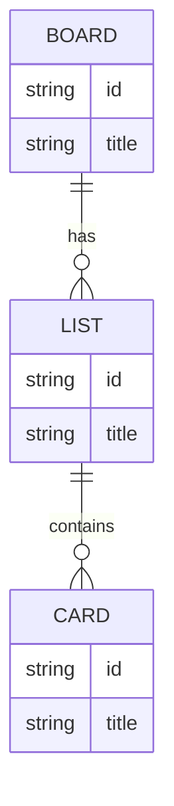
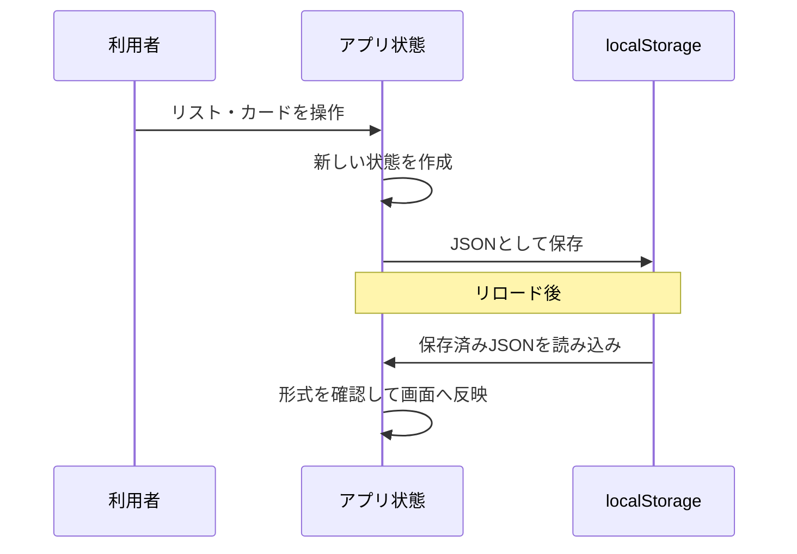

# データ設計

この資料の概念モデルは要件確認に使用する。localStorageのキー名、JSON形式、復元処理などの実装詳細は内部設計として扱う。

## 1. 前提

MVPではバックエンドのデータベースを使用しない。ブラウザのlocalStorageに、ボード全体をJSON形式で保存する。したがって本資料はRDBのテーブル設計ではなく、アプリケーションのデータモデルと永続化形式を定める。

## 2. 概念モデル



## 3. 論理データ構造

初期実装では、データの関係を追いやすい入れ子構造を採用する。保存済みデータがない場合は、以下のサンプルデータを初期状態として使用する。

```json
{
  "id": "board-1",
  "title": "タスクボード",
  "lists": [
    {
      "id": "list-1",
      "title": "未着手",
      "cards": [
        { "id": "card-1", "title": "要件を確認する" },
        { "id": "card-2", "title": "画面を作る" }
      ]
    },
    {
      "id": "list-2",
      "title": "進行中",
      "cards": [
        { "id": "card-3", "title": "ドラッグ&ドロップを実装する" }
      ]
    },
    {
      "id": "list-3",
      "title": "完了",
      "cards": [
        { "id": "card-4", "title": "プロトタイプを作成する" }
      ]
    }
  ]
}
```

| エンティティ | 項目 | 型 | 説明 |
|---|---|---|---|
| Board | id | string | ボードを識別するID。MVPでは1件のみ。 |
| Board | title | string | 画面に表示するボード名。 |
| Board | lists | List[] | 表示順のリスト配列。配列の順番が表示順となる。 |
| List | id | string | リストを識別するID。 |
| List | title | string | 利用者が入力するリスト名。 |
| List | cards | Card[] | 表示順のカード配列。配列の順番が表示順となる。 |
| Card | id | string | カードを識別するID。 |
| Card | title | string | 利用者が入力するカード名。 |

## 4. 保存・復元



- localStorageのキー名は、実装時にアプリ固有の名前（例：`taskapp.board.v1`）を使用する。
- 保存済みデータが存在しない場合のみサンプルデータを初期表示する。保存済みデータがある場合は、その内容を優先する。
- 保存前に、状態をJSONへ変換できることを確認する。
- 復元時にJSON解析または構造確認に失敗した場合は、初期状態を使用する。
- 保存に失敗した場合は、メモリ上の表示状態を維持し、保存失敗を利用者へ通知する。
- 将来データ構造を変更する場合に備え、キー名またはデータ内にバージョンを持たせることを検討する。
