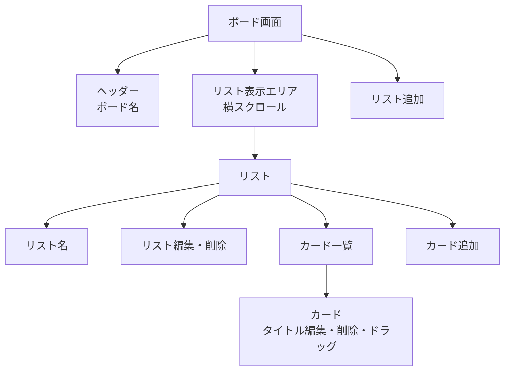
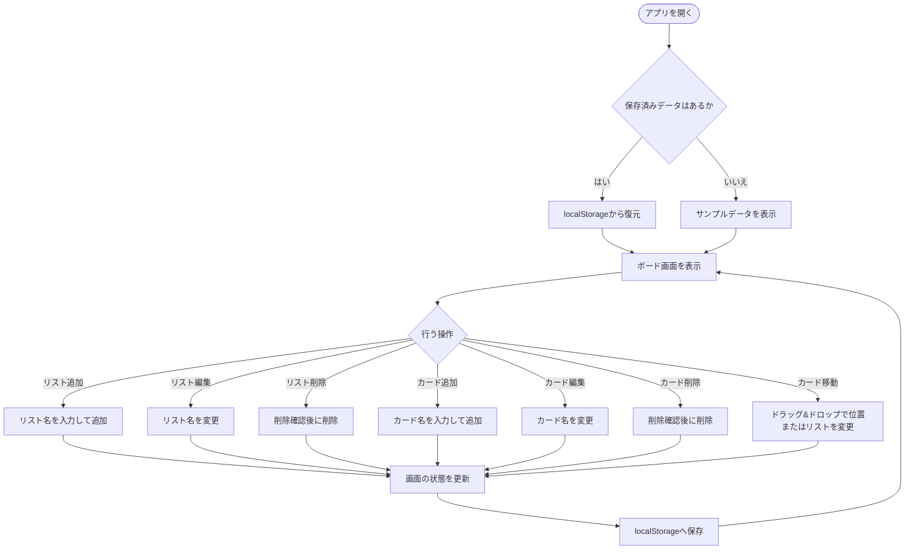
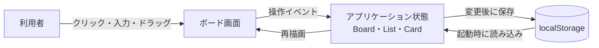
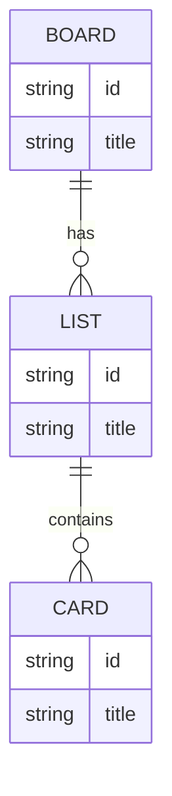

# タスク管理アプリ（Trelloライク） 概念設計図

## 1. この資料の目的

この資料は、MVPで作る画面、利用者の操作、データの流れ、およびデータ同士の関係を、実装前に共通認識として整理するためのものである。

- 対象は単一利用者・単一ボードのタスク管理アプリとする。
- 実装の詳細なコンポーネント構成やライブラリは、この資料では確定しない。
- 図はすべて Mermaid 記法で記述し、Markdown上で更新できるようにする。

## 2. 画面構成

MVPでは画面はボード画面の1画面のみである。リストとカードの操作は、画面遷移ではなく、同じ画面内で行う。

## 3. 操作フロー

利用者はボード上でリストとカードを管理する。すべての変更は画面上の状態に反映され、保存対象となる。

## 4. データフロー

Reactの状態を画面表示の正とし、変更後の状態をlocalStorageへ保存する。起動時にはlocalStorageのデータを読み込み、表示用の状態を復元する。

## 5. データモデル図（ER図風）

データベースを使用しないため、これはテーブル定義ではなく、アプリ内で扱うデータの関係を示す概念モデルである。Boardは1件、Listは0件以上、Cardは各Listに0件以上存在できる。

## 6. 設計上の確認事項

- 空文字や空白だけのリスト名・カード名を登録できないようにするか。
- カードを含むリストを削除する際、確認ダイアログを表示するか。
- localStorageのデータが破損していた場合、初期状態で起動するか。

これらは、次の「画面・操作の詳細」と「データ要件」で確定する。
