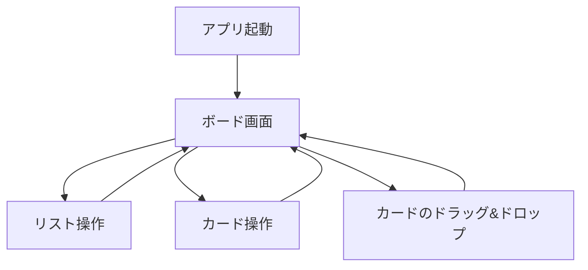
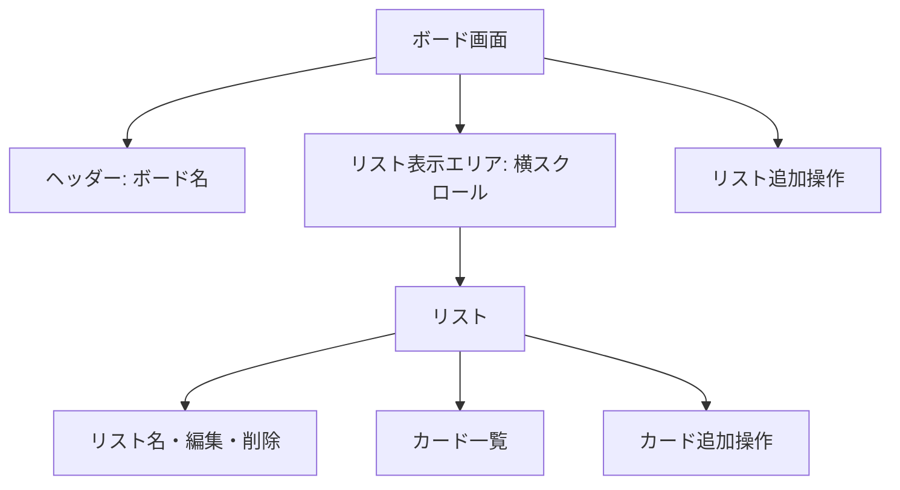

# 画面設計

## 1. 画面一覧

MVPはボード画面の1画面構成である。別画面への遷移はなく、追加・編集・削除はボード画面内で行う。保存済みデータがない初回起動時は、サンプルリスト・カードを持つボードを表示する。

## 2. ボード画面の構成

## 3. 画面要素と振る舞い

| 要素 | 表示内容 | 操作・振る舞い |
|---|---|---|
| ヘッダー | 固定のボード名 | MVPではボード名の変更機能は持たない。 |
| リスト表示エリア | リストを横並びで表示 | リスト数が画面幅を超えた場合、横方向に閲覧できる。 |
| リスト | リスト名、操作、カード一覧、カード追加 | 各リストはカードのドロップ先になる。 |
| リスト追加 | リスト名入力欄または追加ボタン | 有効な名前で追加後、入力状態を閉じる。 |
| カード | カードのタイトル | 編集、削除、ドラッグ開始ができる。キーボード操作の利用者には、移動の代替操作を提供する。 |
| カード追加 | カード名入力欄または追加ボタン | 有効な名前で対象リストの末尾へ追加する。 |
| 削除確認 | 確認メッセージと実行・取消操作 | 実行時のみ削除し、取消時は表示を元に戻す。 |

## 4. 表示状態

| 状態 | 表示・対応 |
|---|---|
| リストが0件 | リストを追加するよう案内する。初回起動時にはこの状態を表示せず、サンプルを表示する。 |
| カードが0件 | そのリスト内にカード追加操作を表示する。 |
| 入力エラー | 入力欄の近くに、登録できない理由を表示する。 |
| ドラッグ中 | 移動中のカードとドロップ先が判別できる見た目にする。 |
| ドラッグ取消・無効なドロップ | 移動前の表示とデータを維持する。 |
| 保存データ異常 | 初期状態を表示し、必要に応じてデータを初期化したことを知らせる。 |
| 保存失敗 | 現在画面の操作結果は保持し、保存できなかったことと再試行が必要なことを知らせる。 |

## 5. 視覚デザイン要件（Trello風）

Trelloのロゴ、アイコン、画像などのブランド資産を複製せず、ボード画面における情報の階層と操作感を参考にする。

| 要素 | デザイン要件 |
|---|---|
| ボード背景 | 画面全体に広がる青系の背景とし、ボード名を上部に明確に表示する。 |
| リスト | 薄いグレーのコンパクトな縦長パネルとし、横方向に並べる。幅を超える場合は横スクロールできる。 |
| カード | 白い面、短いタイトル、控えめな影を使い、リスト内でカードを区別できるようにする。 |
| 操作 | 追加操作はリスト下部、編集・削除などの補助操作はカードやリストの近くにコンパクトに配置する。 |
| 状態表示 | ドラッグ中とドロップ先は、背景色や枠線で明確に区別する。 |
| レスポンシブ | PCを主対象としつつ、小さい画面でもリストの横スクロールと操作ボタンを利用できるようにする。 |

## 6. 初期サンプル

保存済みデータがない場合、次の内容を初期表示する。サンプルは通常のリスト・カードと同じように編集・削除・移動できる。

| リスト | カード |
|---|---|
| 未着手 | 要件を確認する、画面を作る |
| 進行中 | ドラッグ&ドロップを実装する |
| 完了 | プロトタイプを作成する |
