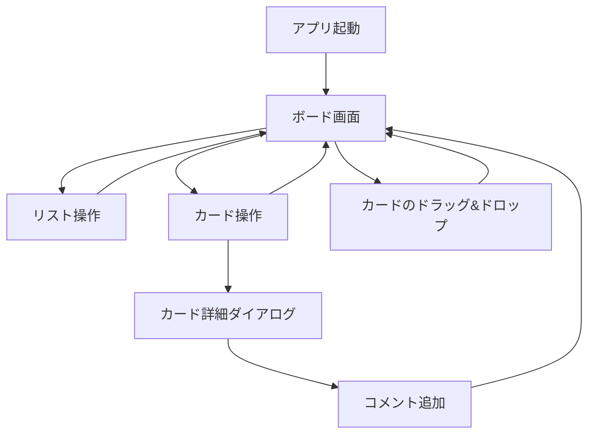
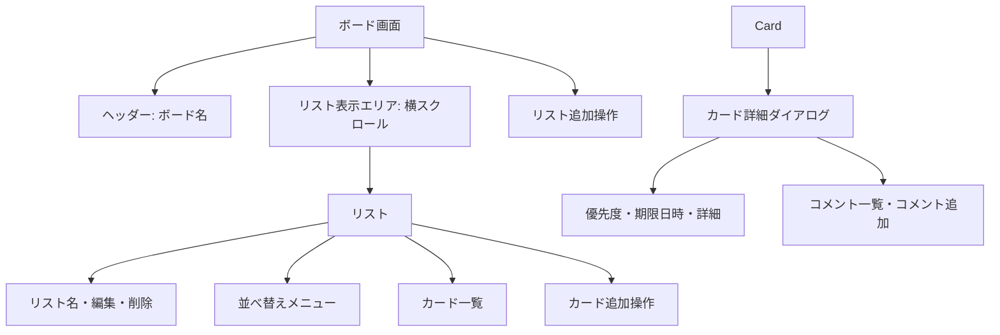

# 画面設計

## 1. 画面一覧

MVPはボード画面の1画面構成である。別画面への遷移はなく、追加・編集・削除はボード画面内で行う。保存済みデータがない初回起動時は、サンプルリスト・カードを持つボードを表示する。

## 2. ボード画面の構成

## 3. 画面要素と振る舞い

| 要素 | 表示内容 | 操作・振る舞い |
|---|---|---|
| 上部ナビゲーション | アプリ名、簡易操作領域 | 見た目のみ。ログイン、検索、通知などの機能は持たない。 |
| ボードヘッダー | ボード名、公開範囲の表示、補助メニュー、共有相当のボタン | ボード名は固定。共有・公開範囲の操作はモックアップ表示のみとする。 |
| リスト表示エリア | リストを横並びで表示 | リスト数が画面幅を超えた場合、横方向に閲覧できる。 |
| リスト | リスト名、操作、並べ替え、カード一覧、カード追加 | 各リストはカードのドロップ先になる。 |
| 並べ替えメニュー | 手動順、優先度順、期限日時順、作成日時順 | 選択した順序で対象リストのカードを並べ替え、保存する。 |
| リスト操作メニュー | リスト編集・削除 | メニューボタンから開く。 |
| リスト追加 | 「別のリストを追加」入口、展開後の入力欄と追加・取消 | 初期状態では入力欄を表示しない。有効な名前で追加後、入力状態を閉じる。 |
| カード | タイトル、設定済みの優先度、期限日時 | カード本体の選択で詳細ダイアログを開く。編集、削除、ドラッグ開始ができる。キーボード操作の利用者には、移動の代替操作を提供する。 |
| カード操作メニュー | カード編集・削除・移動 | カードの詳細表示とは別のメニューボタンから開く。メニューは対象カードに重ならず、開いているメニューは1つだけにする。キーボードで操作できる。 |
| カード追加 | 「カードを追加」入口、展開後の入力欄と追加・取消 | 初期状態では入力欄を表示しない。有効な名前で対象リストの末尾へ追加する。 |
| カード詳細ダイアログ | タイトル、優先度、期限日時、詳細、コメント一覧、コメント入力欄 | カード選択時に開く。編集内容と追加したコメントは保存する。閉じる操作でボードへ戻る。 |
| コメント | 本文、記入日時 | カード詳細内に作成日時順で表示する。コメント追加後、本文と記入日時を保存する。 |
| 削除確認 | 確認メッセージと実行・取消操作 | 実行時のみ削除し、取消時は表示を元に戻す。 |

## 4. 表示状態

| 状態 | 表示・対応 |
|---|---|
| リストが0件 | リストを追加するよう案内する。初回起動時にはこの状態を表示せず、サンプルを表示する。 |
| カードが0件 | そのリスト内にカード追加操作を表示する。 |
| 期限未設定 | カード上では期限表示を省略し、詳細ダイアログで未設定と表示する。 |
| カード詳細表示中 | 背景のボード操作を無効にし、フォーカスを詳細ダイアログ内に移す。 |
| コメント未登録 | コメントを追加するよう案内する。 |
| 入力エラー | 入力欄の近くに、登録できない理由を表示する。 |
| ドラッグ中 | 移動中のカードとドロップ先が判別できる見た目にする。 |
| ドラッグ取消・無効なドロップ | 移動前の表示とデータを維持する。 |
| 保存データ異常 | 初期状態を表示し、必要に応じてデータを初期化したことを知らせる。 |
| 保存失敗 | 現在画面の操作結果は保持し、保存できなかったことと再試行が必要なことを知らせる。 |

## 5. 視覚デザイン要件（Trelloに近い操作感）

Trelloのロゴ、固有アイコン、画像、文言などのブランド資産は使用しない。一方で、ボード画面における情報階層、余白、操作の表示タイミング、リストとカードの構成は、Trelloのボード表示に可能な限り近づける。

| 要素 | デザイン要件 |
|---|---|
| 全体構成 | 上部にコンパクトなナビゲーション領域とボード操作領域を置き、その下に横スクロール可能なボードを表示する。 |
| 背景 | 単色または控えめなテクスチャの青系背景とする。強いグラデーションは使用しない。 |
| ボードヘッダー | ボード名を左寄せで表示し、その近くに公開範囲を示す表示、操作メニュー、共有操作に相当するUIをコンパクトに配置する。ただし共同編集・共有機能自体は実装しない。 |
| リスト | 薄いグレーの縦長パネルを横並びにする。幅はおおむね一定とし、角丸と影は控えめにする。 |
| リストヘッダー | リスト名を強調し、編集・削除などの補助操作は常時テキスト表示せず、メニューボタンから表示する。 |
| カード | 白地のコンパクトな面とし、タイトルを主情報として表示する。優先度と期限日時を設定した場合のみ、タイトル下部に控えめな補助情報として表示する。カード全体を選択可能に見せ、補助操作はホバー時またはメニュー内で表示する。 |
| カード詳細 | 画面中央のダイアログとして表示する。左側にタイトル・優先度・期限日時・詳細、下部にコメント一覧と追加欄を配置し、情報を読み書きしやすくする。 |
| メニュー | 操作メニューは対象要素の近くに表示するが、カード本文、カード詳細ダイアログ、他のメニューと重ならないようにする。 |
| カード追加 | 各リスト下部には、初期状態で入力欄を常時表示せず、「カードを追加」入口のみを表示する。選択時に入力欄と追加・取消ボタンを展開する。 |
| リスト追加 | 常時表示の入力フォームではなく、横並びのリスト末尾に「別のリストを追加」入口を表示する。選択時に入力欄と追加・取消ボタンを展開する。 |
| 編集 | リスト名・カード名は、可能な限りその場で編集できるUIとする。ブラウザ標準のpromptは使用しない。 |
| 削除 | 削除はメニューから開始し、確認ダイアログを表示する。危険操作であることが分かる色と文言を用いる。 |
| カード移動 | ドラッグ中のカードは半透明または浮き上がった状態にし、移動先は背景色またはプレースホルダーで示す。 |
| キーボード操作 | キーボード移動は常時並ぶ矢印ボタンではなく、カードの操作メニューまたはカード詳細内の「移動」操作から利用できるようにする。 |
| レスポンシブ | PC表示を主対象とする。画面幅が不足する場合は、ボード部分だけを横スクロール可能にし、リスト幅を極端に縮小しない。 |

## 6. 初期サンプル

保存済みデータがない場合、次の内容を初期表示する。サンプルは通常のリスト・カードと同じように編集・削除・移動できる。

| リスト | カード |
|---|---|
| 未着手 | 要件を確認する、画面を作る |
| 進行中 | ドラッグ&ドロップを実装する |
| 完了 | プロトタイプを作成する |
